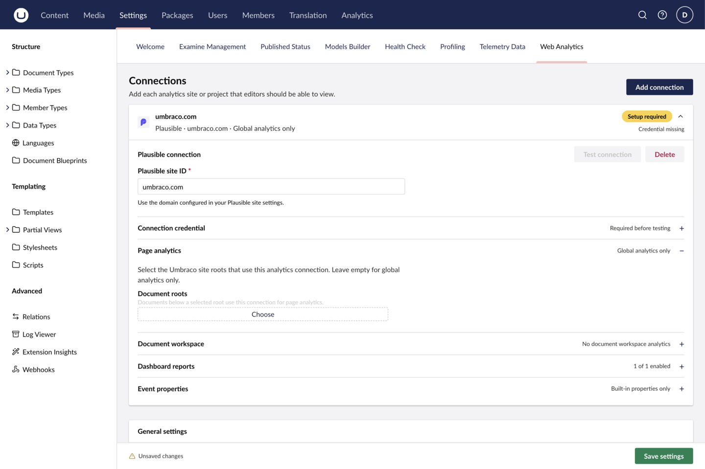

This guide covers the shared path for both providers. Provider-specific identifiers and capabilities are covered in the [Vercel](/providers/vercel) and [Plausible](/providers/plausible) guides.

## 1. Install the package

Add Web Analytics to the Umbraco web project:

```sh
dotnet add package TheBuilder.WebAnalytics
```

The package registers its services and backoffice extensions automatically. Build and deploy the Umbraco application as usual; NuGet static web assets include the package's `App_Plugins` files.

## 2. Choose a provider, configure its secret, and restart

Create a read-only credential with access to the provider account or site being connected. Add it to the application's secret configuration—not `appsettings.json` and never source control. Restart every Umbraco application instance after adding or rotating the credential.

Choose the provider that already collects your site analytics. Use the [Vercel](/providers/vercel) or [Plausible](/providers/plausible) guide for its credential, connection identifier, and any provider-specific setup.

For local development, use either a shell environment variable or .NET user secrets:

<CodeGroup>

```sh Vercel
dotnet user-secrets init --project path/to/Your.Umbraco.Web.csproj
dotnet user-secrets set "WebAnalytics:Providers:Vercel:AccessToken" "your_token" --project path/to/Your.Umbraco.Web.csproj
```

```sh Plausible
dotnet user-secrets init --project path/to/Your.Umbraco.Web.csproj
dotnet user-secrets set "WebAnalytics:Providers:Plausible:AccessToken" "your_stats_api_key" --project path/to/Your.Umbraco.Web.csproj
dotnet user-secrets set "WebAnalytics:Providers:Plausible:BaseUrl" "https://analytics.example.com/" --project path/to/Your.Umbraco.Web.csproj
```

</CodeGroup>

Use the equivalent secret or app-setting facility in your hosting platform.

## 3. Add and test the connection

As an administrator, open **Settings → Web Analytics**.

1. Select **Add connection**.
2. Choose Vercel or Plausible. The provider cannot be changed after creation.
3. Enter the provider identifier.
4. Select **Save settings**, then **Test connection**.
5. Review the credential status. The settings screen reports whether it detected a shared credential or a connection override. It does not display or store a token.



## 4. Verify the dashboard

Open the global **Analytics** section. Check that totals and history load, then use a known date range with recorded production traffic.

If reports do not load, start with [troubleshooting](/reference/troubleshooting). A provider may hide an unsupported panel; that is different from a failed connection.

## Next step

Configure [document analytics](/guides/document-analytics) when editors should see a report while editing a mapped document.
