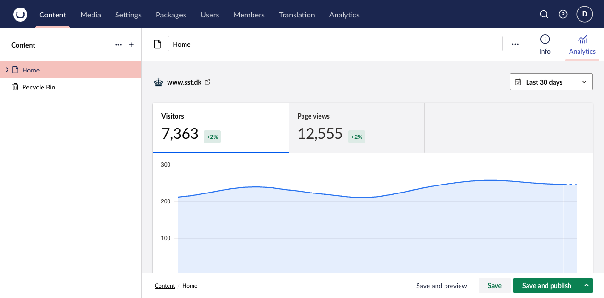

Document mappings are optional. A connection without a mapping remains available in the global Analytics section but does not add a document workspace report.

## Map an Umbraco site root

For each site that needs page-level reports, choose the root document in the connection's **Page analytics** settings. The nearest mapped ancestor determines which analytics connection a document uses.

Then either enable all document types below that root or choose the specific document types that should show the Analytics workspace view.

## When the workspace appears

A document shows its Analytics workspace view only when all of these conditions are met:

- It is published and has a published route.
- Its nearest configured document root resolves to a connection.
- Its document type is enabled for that connection.
- The current user can access the Content section and browse that document.

The report is automatically filtered to the selected published route. This lets an editor inspect the page they are working on without first finding it in a global report.

## Multi-site example

Imagine one Umbraco installation with two site roots:

| Root document | Connection | Result |
| --- | --- | --- |
| `Brand A` | Vercel project A | Documents below Brand A report against project A. |
| `Brand B` | Plausible site B | Documents below Brand B report against site B. |

If a nested root is mapped too, it wins for documents below it because it is the nearest mapped ancestor.

## Permissions

Global and document analytics are intentionally separate:

| User | Global Analytics | Document Analytics | Settings |
| --- | --- | --- | --- |
| Administrator | Yes | Yes, where mapped | Yes |
| Analytics-section user | Yes | Only with Content access and document browse permission | No |
| Editor with Content access and document browse permission | No | Yes, where mapped and published | No |

This means an editor can see analytics for a document they can browse without gaining access to global site reporting.

## Troubleshoot a missing workspace

Check publication and route state first, then the nearest root mapping and document-type setting. If the workspace still does not appear, verify Content-section access and document browse permission. See [troubleshooting](/reference/troubleshooting) for the full symptom checklist.
