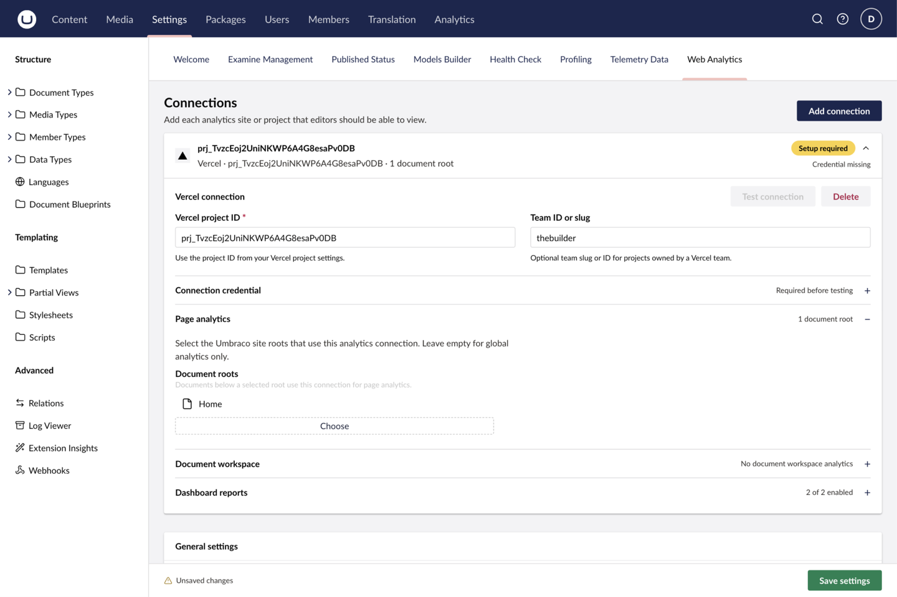

Document mappings are optional. A connection without a mapping remains available in the global Analytics section but does not add a document workspace report. Document reports do not require global Analytics-section access.

## Map an Umbraco site root

For each site that needs page-level reports, choose the root document in the connection's **Page analytics** settings. A document uses the connections from its nearest mapped ancestor; it does not use connections from merely any ancestor root. A mapped document report is automatically filtered to its selected published route.

Then either enable all document types below that root or choose the specific document types that should show the Analytics workspace view.

You can map more than one connection to the same root, for example when the site reports to both Vercel and Plausible. When more than one mapped connection supports the document type, the workspace shows a provider selector. Its selection is remembered in that browser for the mapped root, so choosing a provider for one site does not change another site's report.

## Choose the path scope

Document analytics initially reports only the selected document's published path. Enable **Include child paths** in the workspace header to report on that path and every path below it. This is useful for section or landing pages; leave it disabled to inspect only the selected page.

## When the workspace appears

A document shows its Analytics workspace view only when all of these conditions are met:

- It is published and has a published route.
- Its nearest configured document root must specifically resolve to one or more connections, not merely any ancestor root.
- Its document type is enabled for at least one of those connections.
- The current user can access the Content section and browse that document.

This lets an editor inspect the page they are working on without first finding it in a global report.

## Multi-site example

Imagine one Umbraco installation with two site roots:

| Root document | Connection | Result |
| --- | --- | --- |
| `Brand A` | Vercel project A | Documents below Brand A report against project A. |
| `Brand B` | Plausible site B | Documents below Brand B report against site B. |

If a nested root is mapped too, it wins for documents below it because it is the nearest mapped ancestor.

You can also map both a Vercel project and a Plausible site to `Brand A`. Editors then choose the provider they need from the document workspace header.

## Permissions

Global and document analytics are intentionally separate:

| User | Global Analytics | Document Analytics | Settings |
| --- | --- | --- | --- |
| Administrator | Yes | Yes, where mapped | Yes |
| Analytics-section user | Yes | Only with Content access and document browse permission | No |
| Editor with Content access and document browse permission | No | Yes, where mapped and published | No |

This means an editor can see analytics for a document they can browse without gaining access to global site reporting.

## Troubleshoot a missing workspace

Check publication and route state first, then the nearest root mapping and document-type setting. If the workspace still does not appear, verify Content-section access and document browse permission. See [troubleshooting](/reference/troubleshooting) for the full symptom checklist.
