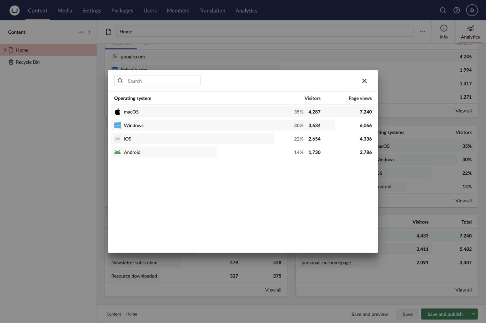
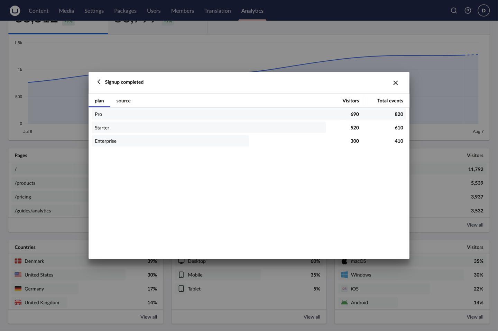
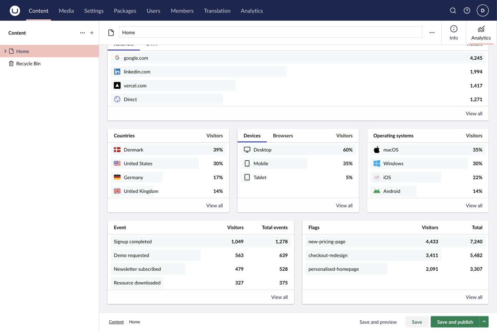
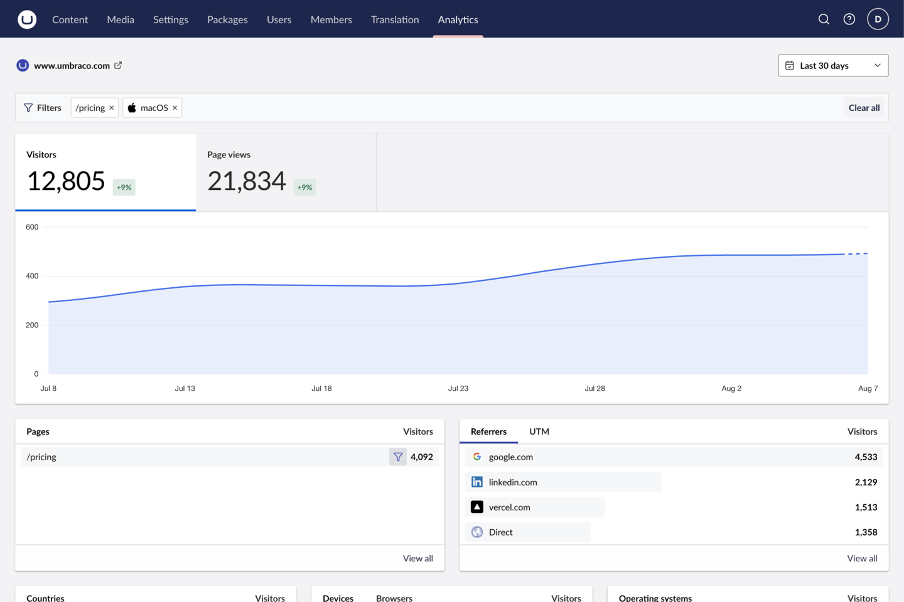

The Analytics section presents one dashboard per connection. This page explains what every part of it shows so you can move from a headline number to the context behind it. It describes the reading experience; for setup see the [quickstart](/quickstart), and for page-level reports see [document analytics](/guides/document-analytics).

## Dashboard controls

The header holds the two controls that shape every report below it.

| Control | What it does |
| --- | --- |
| **Analytics connection** | Switches between configured connections when more than one exists. Every metric, breakdown, and filter is scoped to the selected connection. |
| **Date range** | Choose a preset (Last 24 hours, Last 7 days, Last 30 days, Last 90 days, or Last 12 months) or set a custom range. The default range is 30 days and is configurable with `DefaultRangeDays`. |

The range you pick also sets how history is grouped: hourly for a single day, daily up to a month, weekly up to a quarter, and monthly beyond that.

## Metrics and history

Two headline metrics sit at the top of the dashboard:

- **Visitors**: the number of distinct people who visited in the selected range.
- **Page views**: the total number of pages those visitors loaded.

Each metric shows its total and, automatically, a comparison against the immediately preceding period of the same length. There is no separate toggle. The badge reads as a signed percentage such as `+12%`, with a fuller description like "12% more visitors than the previous 30 days". When the previous period has no data to compare against, the badge is omitted rather than shown as a misleading change.

Select a metric to plot it over time. The history chart uses the interval implied by the range, and the final segment is drawn as in-progress when the current period is not yet complete.

## Breakdowns

Breakdowns rank the dimensions that make up your traffic. Each card lists the top contributors with a proportional bar and the metric value; **View all** opens a searchable dialog with the complete, filterable list.

| Card | Shows |
| --- | --- |
| **Pages** | The most-visited request paths. (Hidden on a document report, which is already scoped to one page.) |
| **Acquisition** | Where traffic came from. A **Referrers** tab lists the sites and sources that sent visitors; when the connection supports UTM reporting, a **UTM** tab adds sub-tabs for **Source**, **Medium**, **Campaign**, **Term**, and **Content** from tagged marketing links. |
| **Countries** | Visitors grouped by country. |
| **Audience** | A tabbed card covering **Devices** and **Browsers**. |
| **Operating systems** | Visitors grouped by operating system. |

UTM reporting is capability- and plan-dependent, so the **UTM** tab appears only when the selected connection can report those dimensions. On a plan-limited connection, the card explains that "UTM reporting availability depends on your analytics plan and reporting window."

## Events

When the provider records custom events, the dashboard adds an **Events** panel listing each event and its total. Select an event and choose **View all events** to open the full, searchable list, then open an event to drill into its properties.

Event-property drill-downs let you break a single event down by a recorded property, for example which URLs an outbound-link event pointed to. For Plausible, configure the property names you want to explore under the connection's event-property settings; see the [Plausible reference](/providers/plausible#event-properties).

## Feature flags

For Vercel connections that report feature flags, a **Flags** panel lists each flag with its totals, and **View all flags** opens the complete list. Plausible does not expose feature flags, so the panel is hidden for Plausible connections rather than shown as an error.

## Filtering and drill-downs

Any breakdown row can become a filter. Hover or keyboard-focus a row to reveal **Filter by this value**; applying it narrows every report on the dashboard to that value, for example only visitors from one country, or only one referrer.

Active filters appear as a **Filters** group beneath the header. Remove an individual filter from its chip, or choose **Clear all** to return to the unfiltered view. Filters, the selected date range, and the chosen breakdown tabs are reflected in the dashboard URL, so a filtered view can be bookmarked or shared.

:::note[Provider differences are expected]
The interface adapts to what each provider supports instead of showing errors. Vercel does not support applying an event or event-property filter to a global report or choosing the ordering metric for a breakdown; Plausible supports both but has no feature flags. A hidden panel means the provider does not offer that capability, not a failed connection. See the [Vercel](/providers/vercel#capabilities) and [Plausible](/providers/plausible#capabilities) references for the exact per-provider capabilities.
:::

## Reports on a document

The same metrics, history, and breakdowns appear in the Analytics workspace on a mapped document, automatically scoped to that document's published route. The document view adds an **Include child paths** toggle to report on either the single page or the whole section beneath it. See [document analytics](/guides/document-analytics) for mapping and permissions.
