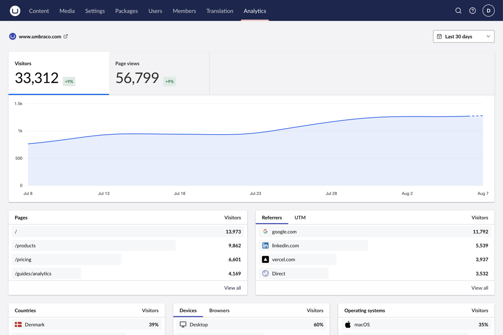

## Supported providers

Choose the reference for the analytics provider your site already has.

<CardGroup cols={2}>
  <Card title="Vercel Web Analytics" href="/providers/vercel">
    Reference connection fields, team projects, feature flags, and Vercel-specific errors.
  </Card>
  <Card title="Plausible" href="/providers/plausible">
    Reference Cloud and self-hosted connections, event properties, and Plausible-specific errors.
  </Card>
</CardGroup>

:::tip[Ready to connect your analytics?]
[Follow the Quickstart](/quickstart) to install the package, connect the provider your site already uses, and verify the dashboard.
:::

## What you get

- **Traffic reports.** Explore visitors, page views, trends, referrers, campaigns, countries, devices, and pages. [Understand what each report means](/guides/reports).
- **Document context.** Show analytics in mapped published document workspaces, scoped to the document's route.
- **Useful detail.** Use date comparisons, filters, and drill-downs to move from a headline number to useful context.
- **Multi-site support.** Add more than one connection to an Umbraco installation.
- **Private credentials.** Keep provider access in server-side application configuration, never in the browser or Umbraco content.
- **No tracking changes.** Read provider-collected data without installing, replacing, or configuring public-site tracking.

## Compatibility

Web Analytics supports Umbraco CMS 17.1 through 18.x. [Vercel Web Analytics](/providers/vercel) and [Plausible](/providers/plausible) both provide core reports, event lists and details, and event-property drill-downs. The interface hides provider capabilities that are not available instead of presenting them as errors.

## Need the details?

The [configuration reference](/reference/configuration) explains configuration precedence, credentials, cache behaviour, and every supported option. Use [troubleshooting](/reference/troubleshooting) for missing access, connection errors, empty reports, and multi-instance deployment issues.
